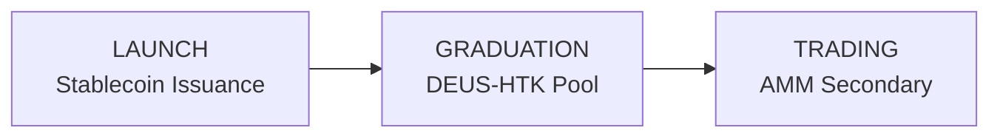

# Robotics Capital Markets Protocol

**Liquid Markets for the Machine Economy**

The Robotics Capital Markets (RCM) Protocol creates liquid, transparent, onchain markets for exposure to robotics ventures, equipment, and revenue streams. It represents a new revenue engine for the XMAQUINA ecosystem.

## The Opportunity: Fee-Generating Protocols Are Printing Money

Decentralized protocols that create liquid markets have proven they can generate massive, sustainable fee revenue:

| Platform    | Revenue | Period       |
| ----------- | ------- | ------------ |
| Uniswap     | \$500M+ | Annual       |
| Pump.fun    | \$500M+ | \< 12 Months |
| Friend.tech | \$50M+  | Peak         |

These platforms solved one fundamental problem: **liquidity**. Uniswap processes billions in daily volume. Pump.fun generated over $500M in fees in under a year. Friend.tech captured $50M+ from social trading alone.

The RCM Protocol applies these proven mechanics to a new asset class: robotics capital.

## Protocol Overview: Onchain Markets for Robotics Assets

Each opportunity launches as an **HTK token**—an equity-anchored token that provides economic exposure through a compliant legal structure.

<CardGroup cols={3}>
  <Card title="What Trades Onchain">
    HTK tokens (e.g., XFIG, XAPP) are fungible tokens representing economic exposure to specific robotics opportunities.
  </Card>
  <Card title="The Anchor">
    Each HTK has an associated SPV or legal entity that holds the underlying instrument—equity, SAFE, revenue contract, or asset lease.
  </Card>
  <Card title="What Holders Get">
    Economic exposure as defined by the market ruleset: exit proceeds, revenue distributions, or redemption rights.
  </Card>
</CardGroup>

## Revenue Model: Every Transaction Generates Revenue

### Fee Structure

| Action            | Fee      | Stage   |
| ----------------- | -------- | ------- |
| Primary Issuance  | 1.0%     | Launch  |
| Secondary Swaps   | 0.30%    | Trading |
| Liquidity Actions | Included | Ongoing |
| Admin/Corporate   | Fixed    | Events  |

All fees are transparent, onchain, and governance-settable.

### Protocol Fee Distribution

<CardGroup cols={2}>
  <Card title="50% → DAO Treasury">
    Operations, legal costs, audits, and liquidity provisioning
  </Card>
  <Card title="50% → DEUS Accrual">
    Staker distributions and buyback/burn mechanisms
  </Card>
</CardGroup>

## DEUS Integration: The Liquidity Backbone

Every HTK market graduates into a **DEUS-HTK liquidity pool**, making DEUS the native trading pair for the entire ecosystem.

### Market Lifecycle

### The DEUS Demand Effect

<AccordionGroup>
  <Accordion title="Buy Pressure">
    Every new market graduation requires purchasing DEUS from open markets to seed liquidity pools.
  </Accordion>
  <Accordion title="Supply Lock">
    LP tokens are time-locked (default: 12 months) with governance-controlled unlock for migrations or security.
  </Accordion>
  <Accordion title="Continuous Utility">
    All secondary trading routes through DEUS pairs, creating ongoing demand as trading volume grows.
  </Accordion>
</AccordionGroup>

## The Value Flywheel: A Self-Reinforcing Revenue Engine

Every successful market strengthens the protocol. Every trade reinforces DEUS as the ecosystem's liquidity backbone.

<Steps>
  <Step title="Launch">
    New HTK market launches → Fees generated on primary issuance
  </Step>
  <Step title="Graduation">
    Market graduates → DEUS purchased and locked in LP
  </Step>
  <Step title="Trading">
    Trading activity → Continuous swap fees split between LPs and protocol
  </Step>
  <Step title="Distribution">
    Protocol fees → 50% to DAO operations, 50% to DEUS value accrual
  </Step>
  <Step title="Expansion">
    More markets launch → Cycle repeats, compounding value
  </Step>
</Steps>

## Transparency: Standardized Disclosure, Not Opacity

Unlike opaque pre-market platforms, every HTK market publishes comprehensive, standardized disclosures. Participants know exactly what they're getting exposure to.

### Disclosure Pack Per HTK Market

| Category                  | Contents                                         |
| ------------------------- | ------------------------------------------------ |
| **Anchor Structure**      | Entity type, jurisdiction, service providers     |
| **Underlying Instrument** | Equity/SAFE/contract/asset and key terms         |
| **Risk Disclosure**       | Liquidity, legal, governance, counterparty risks |
| **Economics**             | Fee schedule, routing, liquidity plan, locks     |
| **Reporting**             | Updates, milestones, material events             |

## Positioning: Best of Three Worlds

HTK markets combine proven mechanics from successful protocols with RWA-grade compliance and disclosure standards.

<CardGroup cols={3}>
  <Card title="Pump.fun Lifecycle">
    Launch → Graduation → AMM model for efficient market formation and price discovery with built-in liquidity bootstrapping.
  </Card>
  <Card title="Uniswap Mechanics">
    Battle-tested AMM infrastructure for secondary liquidity, LP rewards, and transparent fee distribution.
  </Card>
  <Card title="RWA Standards">
    Professional disclosures, compliant anchor structures, and explicit rights frameworks for institutional credibility.
  </Card>
</CardGroup>

**The difference:** Instead of memecoins or social tokens, these markets are anchored to real robotics ventures, equipment, and revenue streams.

## Capital Flow: Where Funds Go at Issuance

Capital raised during HTK market launches is allocated transparently, with the majority funding the underlying investment.

<CardGroup cols={3}>
  <Card title="Anchor Deployment" icon="building">
    Majority routes to the SPV to acquire/hold the underlying instrument or fund deployment into the target asset.
  </Card>
  <Card title="Liquidity Reserve" icon="droplet">
    Defined portion reserved to seed the DEUS-HTK liquidity pool at graduation.
  </Card>
  <Card title="DAO Treasury" icon="landmark">
    Operational allocation for legal costs, audits, ongoing administration, and ecosystem development.
  </Card>
</CardGroup>

<Note>
  Reserve/unsold allocation policy (burn, reserve, incentives, future issuance) is disclosed upfront per market.
</Note>

## Summary: A Protocol Built for Sustainable Value

<CardGroup cols={4}>
  <Card title="1.0%">
    Primary Issuance Fee
  </Card>
  <Card title="0.30%">
    Secondary Swap Fee
  </Card>
  <Card title="50/50">
    DAO / DEUS Fee Split
  </Card>
  <Card title="12 Mo">
    Default LP Lock
  </Card>
</CardGroup>

### Key Takeaways

The future of robotics capital formation happens onchain. XMAQUINA is building the infrastructure.

- **Revenue engine:** Every transaction generates fees for DAO and DEUS holders
- **Structural demand:** Market graduations create continuous buy pressure on DEUS
- **Locked liquidity:** LP locks remove DEUS from circulation, reducing sell pressure
- **Compounding flywheel:** More markets = more fees = more value accrual
- **Transparent:** Standardized disclosures, onchain fees, governance-settable parameters

---

_Q1 2026 | XMAQUINA_