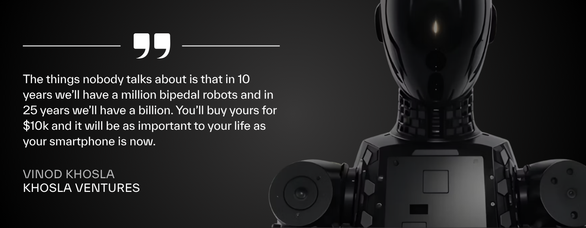

## The Largest Market Opportunity of Our Time

Humanoid robotics is set to become the most disruptive technology since the internet. As robots begin operating in human environments, the era of Physical AI is no longer theoretical. It is already unfolding.

2025 has already proven the scale of the opportunity: Figure AI is valued at \$39.5B, and Apptronik recently hit \$6B. The market is moving faster than anyone expected.

Many of the leading companies remain private. OpenAI, still private at a \$500B valuation, shows how long these companies can scale before public markets come into play.

XMAQUINA exists to give its community early exposure to this historic opportunity.

## Why Humanoid Robots?

Pop culture often paints humanoid robots as threats, from Terminator to Ex Machina. Yet despite these cautionary tales, the pursuit of human-like machines is accelerating. Why?

Brett Adcock, CEO of Figure, puts it simply:

> **_Our world has been built by humans, for humans. Every tool, every environment, every machine is designed around the human form._**

A wheeled robot can’t climb stairs. A quadruped might handle stairs, but it can’t drive a car or ride a bicycle. To unlock true utility, robots must operate in the same world we do, a world designed for two legs, two hands, and one head.

Most objects are sized for the average adult human. Even humans outside that range face challenges. That is why humanoid robots of average height and build offer the greatest versatility.

The takeaway for investors is clear. Humanoids are the ultimate general-purpose platform. They are not just another niche tool. They are the access point to every environment, every task, and every industry. They will not replace specialized machines, and they should not. Their role is to step in where humans cannot or will not, filling the labor gaps no other machine can address.

## The Current Landscape

Humanoid robotics is no longer science fiction. Progress is accelerating:

- **Tesla Optimus**: walking, climbing, and recovering from falls
- **Figure 02**: now tested in BMW factories
- **Agility’s Digit**: deployed in logistics pilots
- **Apptronik Apollo**: backed by Google DeepMind, BMW
- **Unitree G1**: aggressively driving down costs in China

Other challengers; 1X Technologies, Agibot, Clone Robotics, Engineered Arts, are innovating fast. The field is entering an explosive growth phase.

## The Future Market

The economic and social impact will be massive.

- **Goldman Sachs** projects \$38B by 2035, but this is likely conservative.
- **ARK Invest** sees a \$24T opportunity.
- **Macquarie** projects \$209B by 2035, with 9.4M units shipped.

Humanoids will touch every major sector: industrial automation, healthcare, logistics, hospitality, and domestic assistance. Aging populations and labor shortages make adoption inevitable.

## The Opportunity

We are entering the explosion phase of the humanoid robotics market.

<Frame>
  
</Frame>

Every major breakthrough in tech, PCs, smartphones, AI, created enormous value during their explosion phase. Even the companies that didn’t “win” generated outsized returns for early investors (Nokia’s market cap grew 2,300% between 1994–1998 before Apple took over).

Humanoid robotics is now entering the same phase. The leading companies are private, and valuations are rising before public access.

This is where XMAQUINA positions itself: building early exposure to private robotics companies and the wider ecosystem of technologies, infrastructure, and applications that will define the humanoid era.