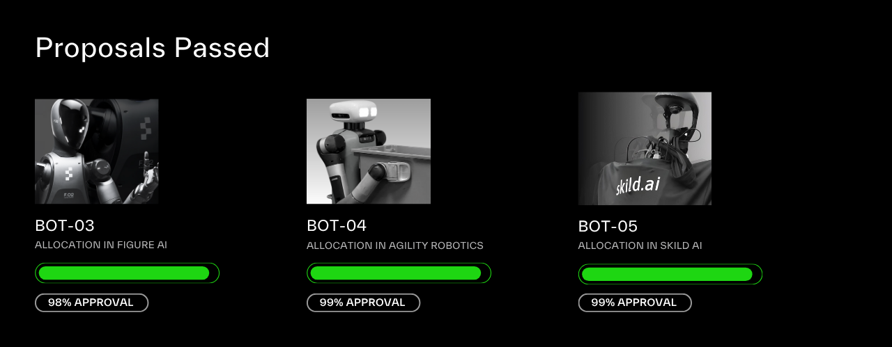

## **DAO Treasury Manifesto**

This manifesto outlines the collective beliefs and treasury allocation strategy of the XMAQUINA DAO, focusing mainly on the private equity portion of the treasury, while touching slighly on the investment thesis for Web3 tokens. In this manifesto, “We” refers to the DAO Members, i.e., individuals and parties who are DEUS token holders. This document was initiated by the Northstar Council, refined through community input, and will be finalized via a Snapshot vote.

## We Believe...

## Humanoid Robots Are the Biggest Opportunity of Our Lifetime

We believe humanoid robotics is the most transformative opportunity in history, and will create unprecedented economic and societal impact. In the next 5 to 10 years, the world will look very different. In this timespan, we anticipate the emergence of a number of \$10+ trillion companies as the world is reshaped by the mass deployment of humanoid robots.

## Winners Will Be a Mix of Established Companies and Emerging Innovators

We anticipate that both established industry leaders and lesser-known private companies will drive the humanoid robots revolution.

**Among established leaders, we believe...**

- **NVIDIA** is likely to dominate as the leading provider of chips critical for both Digital AI and Physical AI. With CEO Jensen Huang increasingly talking about humanoid robotics, the message is clear: NVIDIA wants to play a big role in this new industry and it has all it takes to be one of the leading players via their chips and world foundational model.
- **Tesla** will be the first to launch a mass-scale Physical AI service via its robotaxi service in June 2025 and they are at the forefront of humanoid robots with their Optimus, which is potentially the most advanced humanoid robot today.
- **OpenAI** will emerge as a leader in humanoid robots by leveraging its AI expertise to develop or acquire promising robotics companies. Its partnership with IO, founded by legendary designer Jony Ive, signals a strong move into hardware innovation.

**Among emerging companies, we think...**

- Private robotics firms hold the greatest growth potential as they refine and scale their technologies. Though currently limited in distribution and market reach, these innovators are advancing extremely fast and attracting huge amount of capital and talent. Standout companies include Apptronik, Figure AI, and Sanctuary AI, which are pushing the boundaries of humanoid robotics.

## Private Companies Will Provide the Most Upside

We believe that private companies operating in the humanoid robotics ecosystem offer the most upside. The DAO’s portfolio should include:

- **Pure players**: Firms designing and building humanoid robots, offering solutions through direct sales or innovative Robot-as-a-Service (RaaS) models.
- **Deeptech Enablers**: Companies developing essential components, such as AI-driven "brains," specialized hardware, or revolutionary energy storage that enhance humanoid functionality. This "picks and shovels" approach targets the critical infrastructure powering the robotics revolution.

## But They Won’t All Win, So the DAO Treasury Needs to Be Diversified

We are probably the most bullish community on humanoid robotics, and by focusing on humanoid robotics private companies, we are making a concentrated bet on this space, but we also recognize the need for diversification to manage risk.

This is why we believe that the DAO should build a portfolio of approximately 10 high-potential humanoid robotics companies: some entirely focused on the humanoid robot, and some focused on components critical for the humanoid robot.

In a few years, we expect the treasury to reflect:

- **A standout winner**: One company could deliver exceptional returns, potentially 100x, by achieving market dominance and reaching a trillion-dollar IPO valuation.
- **Several strong performers**: A few companies may yield 3x to 10x returns through acquisitions by tech giants or by establishing solid market positions.
- **Some under-performers**: Certain investments may falter due to intense competition, business challenges, or technological hurdles.

This diversified portfolio will position the DAO treasury to capture significant upside in the highest growth opportunity of our lifetime.

## Web3 Will Play a Role in the Data Collection

We believe Web3 technologies will play a role in the humanoid robotics ecosystem, particularly in decentralized data collection and processing. Web3 protocols can enable secure, transparent, and efficient data marketplaces for training AI models, powering humanoid robots, and enabling collaboration across the ecosystem.

The DAO members are knowledgeable on Web3 and should select the projects that are going to benefit the most from the robotics revolution.

## What We Do?

## We Are Wiser Together

The XMAQUINA DAO harnesses the collective wisdom of its community to shape investment decisions. DAO members collaborate to identify promising companies, conduct thorough due diligence, evaluate options, and propose candidates for treasury allocation.

DAO members vote on:

- The selection of portfolio companies.
- The allocation size for each investment.

This collaborative approach aligns with the community’s shared vision and expertise, optimizing its investment strategy. As a DAO, we aim to attract diverse talent to our community, inviting contributors to bring expertise and growth together.

## We Do Due Diligence on Companies and Web3 Projects

For private robotics companies, our due diligence should focuses on selecting:

- **Elite teams**: We prioritize companies led by top-tier teams building cutting-edge humanoid robotics. These teams must demonstrate innovation, technical expertise, and the ability to scale effectively.
- **Well-funded ventures**: As a DAO, we target companies with substantial funding, avoiding early-stage bets typical of VCs. First, a decentralized organization won’t have the ability to make this kind of early bets. Second, and more importantly, after talent, capital is the most critical resources needed to deliver world-class humanoid robots. Significant capital fuels development, training, and production, providing a competitive edge we prioritize. This explains the current race among robotics companies to amass large capital reserves, as they compete to lead the humanoid robotics revolution.
- **Strategic partnerships**: Companies with robust partnerships gain a distinct advantage in building, developing, and scaling their technology. Access to influential collaborators is a key differentiator we evaluate closely.
- **Compelling demos**: We seek companies showcasing tangible technological progress through functional prototypes or market-ready products, validating their potential for real-world impact.

## We Care About the Present and Future Holders

The decision that we make as a collective should be good for the future holders too. We have a natural incentive to make the right decision in the present for us, the current DAO members. It’s harder to think about the future DAO members but we should nevertheless work hard for them.

In practise, itmeans that we should avoid making a treasury decisions that would benefit us in the short-term to the detriment of future token holders. We are a long-term focused DAO.

## **We Move Fast**

As a decentralized entity, it is usually harder to move as fast as centralized entity. While we will always longer process due to the validation and voting process, we should aim to move the fastest way possible to be able to secure the allocations that we want.

## What We Understand

## We Are Early

While we are immersed in our humanoid robotics bubble, the broader world remains largely unaware of the rapid progress in this field. Just as early adopters of Bitcoin, Ethereum, or Solana reaped significant rewards, we are positioning ourselves at the forefront of a transformative trend.

We are early and we understand the consequence of being early.

## We Won’t Be Able to Be Exposed to Everything We Want

Deals are not always available. While the DAO may target specific assets, deals are not always available. Conversely, unexpected opportunities may arise, requiring the DAO to move fast. The XMAQUINA DAO should be prepared to adapt, moving decisively when new prospects emerge and remaining patient when opportunities are scarce.

## We Will Have to Be Patient

Investing early demands discipline and patience. Many early Bitcoin investors sold after a 10x gain from \$200, only to regret missing its greater potential. This underscores the challenge of staying committed. As a DAO united in our belief that humanoid robots will transform the world, we are steadfast in our vision. While the robotics revolution is advancing rapidly, significant impact may take five years to fully unfold, this is faster than Bitcoin’s rise but without the fleeting thrill of memecoins.

The XMAQUINA DAO is committed to the long haul, balancing agility with strong conviction.