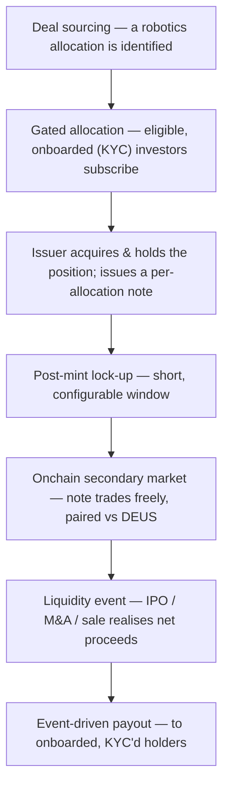

<Note>
  High-level and **directional**. Mechanics, token structure, fees, and legal form are being finalized with counsel and **may change**. Nothing here is an offer or solicitation; participation in an allocation is limited to **eligible, onboarded investors** under the applicable framework.
</Note>

## At a glance

Each robotics allocation moves through a defined lifecycle — from sourcing, to a **gated capital-formation round for eligible investors**, to a **freely-tradable onchain market** — with returns driven by the underlying position's own **liquidity events**.

## The lifecycle

1. **Deal sourcing.** A robotics allocation aligned with the mandate is identified and evaluated.
2. **Gated capital formation.** Capital is raised through a **gated allocation round** open only to **eligible, onboarded investors** (KYC / eligibility checks) — **not a public sale**. If a minimum threshold isn't reached, the allocation doesn't proceed and subscriptions are returned.
3. **Issuance.** A dedicated **issuer** acquires and holds the position (directly or via an SPV) and issues a **per-allocation note** — a **limited-recourse** claim that tracks the **net realised proceeds** of that single position. Holders do **not** receive equity, shares, or voting rights in the underlying company.
4. **Lock-up.** Freshly-issued notes carry a short, **configurable post-mint lock-up** before they become transferable.
5. **Onchain secondary market.** After the lock-up, the note is **freely transferable** and trades on decentralized exchanges, **paired against DEUS**. Secondary liquidity is seeded and operated by an **independent market maker** — not the issuer.
6. **Returns.** There is **no holder-initiated redemption**. Returns are **event-driven**: when the underlying position has a **liquidity event** (e.g. IPO, acquisition, secondary sale), the net proceeds are distributed to **onboarded, KYC'd holders**.

## The DEUS flywheel

Every allocation market is **paired against DEUS** as the base asset, so each new allocation routes more activity through DEUS — positioning it at the center of RCM liquidity. Protocol governance oversight sits with **xDEUS** holders, and a **protocol-level fee** is designed to accrue to the DAO ecosystem *(the exact fee model is being finalized)*.

## Roles, kept separate by design

A core principle of the RCM Protocol is a clean separation between the regulated issuance layer and the protocol/market layers:

- **Issuer** — acquires and holds the position and issues the note; runs the gated primary allocation and any payouts. Does **not** operate the market.
- **Protocol / app layer** — the public interface and protocol infrastructure.
- **Independent market maker** — seeds and operates secondary liquidity, on its own account.

<Info>
  Participation is intended for **eligible investors** under the applicable offering framework. Final eligibility, note terms, fees, and the legal structure will be published as structuring completes.
</Info>
