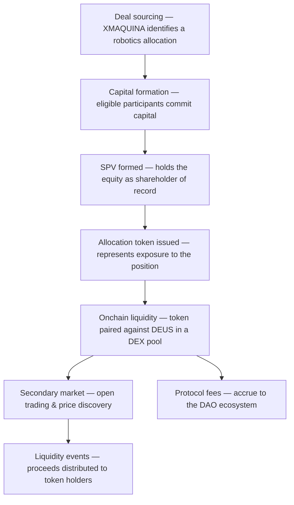

<Note>
  High-level and **directional**. Mechanics, token structure, and legal form are being finalized with counsel and **may change**. Nothing here is an offer or solicitation.
</Note>

## At a glance

Each robotics allocation moves through a defined lifecycle — from sourcing, to capital formation, to an open onchain market.

## The steps

1. **Deal sourcing.** XMAQUINA evaluates robotics allocation opportunities aligned with its mandate.
2. **Capital formation.** Capital is coordinated onchain for a specific allocation. If a minimum threshold isn't reached, the allocation doesn't proceed.
3. **SPV formation.** A dedicated Special Purpose Vehicle (SPV) holds the acquired equity and is the shareholder of record.
4. **Token issuance.** A per-allocation token is issued, representing economic exposure to that SPV-held position.
5. **Liquidity deployment.** The token is paired against **DEUS** in a decentralized liquidity pool, creating an open market around the allocation.
6. **Ongoing activity.** Secondary trading enables price discovery; protocol fees accrue to the DAO ecosystem; and proceeds from liquidity events flow to token holders.

<Info>
  Participation is intended for **eligible participants** under the applicable offering framework. Final eligibility, token terms, and the legal structure will be published as structuring completes.
</Info>
